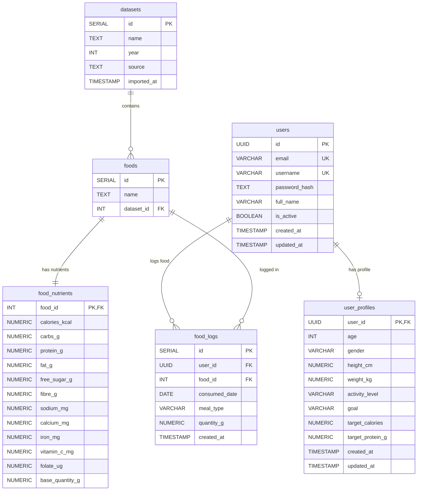

# NutriTrack Backend Documentation

Welcome to the backend documentation for **NutriTrack**, a high-performance RESTful API service built with Node.js, Express, and PostgreSQL. NutriTrack provides nutritional tracking, biometric target calculations, food logging with proportional macro/micro-nutrient scaling, dataset search, and an AI nutritional chatbot assistant.

---

## 📐 Architecture & Design Overview

The NutriTrack backend is built following a **Domain-Driven Modular Monolith Architecture** with a strict **3-Tier Layered Pattern** inside each domain module. This ensures separation of concerns, high maintainability, easy testability, and clean scalability.

```
                   ┌─────────────────────────────────────────┐
                   │               Client App                │
                   └────────────────────┬────────────────────┘
                                        │ HTTP Requests (JSON / Bearer Token)
                                        ▼
                   ┌─────────────────────────────────────────┐
                   │          Express Server (server.js)     │
                   └────────────────────┬────────────────────┘
                                        │ Global Middlewares (CORS, Express.json)
                                        ▼
 ┌──────────────────────────────────────────────────────────────────────────┐
 │                            Domain Modules                                │
 │  ( /auth , /profile , /food , /food-logs , /chatbot , /user )             │
 ├──────────────────────────────────────────────────────────────────────────┤
 │                                                                          │
 │  1. Routes Layer (*.routes.js)                                           │
 │     └─ Parses HTTP endpoints, applies auth middleware & parameters       │
 │                                                                          │
 │  2. Controller Layer (*.controller.js)                                   │
 │     └─ Handles Request/Response, status codes, and delegates to service  │
 │                                                                          │
 │  3. Service Layer (*.service.js)                                         │
 │     └─ Business logic, calculations (BMR/TDEE), and PostgreSQL queries    │
 │                                                                          │
 └──────────────────────────────────┬───────────────────────────────────────┘
                                    │ SQL Queries (pg Pool)
                                    ▼
                   ┌─────────────────────────────────────────┐
                   │           PostgreSQL Database           │
                   └─────────────────────────────────────────┘
```

### Key Architectural Highlights
- **Layer Separation**:
  - **Routes (`*.routes.js`)**: Defines routes, HTTP methods, route-level authorization, and maps requests to controller handlers.
  - **Controllers (`*.controller.js`)**: Manages request extraction (`req.body`, `req.query`, `req.params`, `req.user`), delegates execution to services, sends HTTP responses, and passes uncaught errors to `next(err)`.
  - **Services (`*.service.js`)**: Contains pure business logic, mathematical formulas, and direct database queries using PostgreSQL pool (`pg`).
- **Standardized Error Handling**: Global Express error middleware catches all standard and custom status-coded errors across any route.
- **Stateless Authentication**: Uses JSON Web Tokens (JWT) sent via `Authorization: Bearer <token>` headers.
- **ES Modules Syntax**: Standardized on native ES Modules (`"type": "module"` in `package.json`).

---

## 🛠️ Tech Stack & Dependencies

- **Runtime**: [Node.js](https://nodejs.org/) (ES Modules)
- **Framework**: [Express.js v5](https://expressjs.com/)
- **Database**: [PostgreSQL](https://www.postgresql.org/) with native `pg` connection pool
- **Security & Authentication**:
  - `jsonwebtoken` — State-free JWT token generation and verification
  - `bcrypt` / `bcryptjs` — Salted password hashing (10 salt rounds)
- **Utility**:
  - `dotenv` — Environment variable loading
  - `cors` — Cross-Origin Resource Sharing enablement

---

## 🗄️ Database Architecture & Schema Design

The PostgreSQL database is structured into normalized tables to store users, profiles, dataset sources, food items, nutritional components, and historical daily logs.



### Database Highlights & Performance Optimizations
1. **UUID Primary Keys**: `users.id` uses PostgreSQL `pgcrypto` `gen_random_uuid()` for collision-resistant unique identifiers.
2. **Upsert Logic (`ON CONFLICT`)**: `user_profiles` uses `INSERT ... ON CONFLICT (user_id) DO UPDATE` to create or update profile data seamlessly.
3. **Automated Timestamp Triggers**: `update_updated_at_column()` PostgreSQL trigger automatically refreshes `updated_at` timestamps on update operations.
4. **Full-Text & Composite Indexes**:
   - `idx_foods_name`: GIN index on `to_tsvector('english', name)` for fast food search queries.
   - `idx_food_logs_user_date`: Composite index on `(user_id, consumed_date)` to optimize daily dashboard query execution.

---

## 🔍 Modules, Methods & Algorithm Analysis

### 1. Auth Module (`/auth`)
- **[auth.routes.js](file:///c:/Users/study/OneDrive/Desktop/Projects/NutriTrack/Backend/src/modules/auth/auth.routes.js)**
  - `POST /auth/register` -> `register`
  - `POST /auth/login` -> `login`
- **[auth.service.js](file:///c:/Users/study/OneDrive/Desktop/Projects/NutriTrack/Backend/src/modules/auth/auth.service.js)**
  - `registerUser({ email, username, password, full_name })`:
    - Validates email/username presence and checks format matching `/^[a-z0-9_]{3,30}$/`.
    - Enforces password length `≥ 8`.
    - Checks database for existing email or username to prevent duplicate keys (`409 Conflict`).
    - Hashes plain text password with `bcrypt.hash(password, 10)`.
    - Inserts user into `users` table and returns user record (excluding password hash).
  - `loginUser({ email, password })`:
    - Queries active user (`is_active = TRUE`) by email.
    - Verifies password using `bcrypt.compare`.
    - Generates JWT containing `{ id, email, username }` payload signed with `JWT_SECRET` and expiration settings.

---

### 2. Profile Module (`/profile`)
- **[profile.routes.js](file:///c:/Users/study/OneDrive/Desktop/Projects/NutriTrack/Backend/src/modules/profile/profile.routes.js)**
  - `GET /profile` -> `getProfile` (Protected)
  - `PUT /profile` -> `updateProfile` (Protected)
- **[profile.service.js](file:///c:/Users/study/OneDrive/Desktop/Projects/NutriTrack/Backend/src/modules/profile/profile.service.js)**
  - `getProfile(userId)`: Performs `INNER JOIN` between `user_profiles` and `users` to return biometric parameters along with account details.
  - `updateProfile(userId, profileData)`: Calculates custom caloric and protein targets before saving to database.

#### 🧮 BMR & TDEE Calculation Algorithm
The profile service calculates daily caloric and macro targets using the **Mifflin-St Jeor Equation**:

1. **Basal Metabolic Rate (BMR)**:
   $$\text{BMR} = 10 \times \text{weight\_kg} + 6.25 \times \text{height\_cm} - 5 \times \text{age} + s$$
   Where $s = +5$ for males and $s = -161$ for females.

2. **Total Daily Energy Expenditure (TDEE)**:
   $$\text{TDEE} = \text{BMR} \times \text{Activity Multiplier}$$
   - `sedentary`: $1.2$
   - `light`: $1.375$
   - `moderate`: $1.55$
   - `active`: $1.725$
   - `very_active`: $1.9$

3. **Goal Adjustment (Target Calories)**:
   - `lose`: $\text{Target Calories} = \text{TDEE} - 500$
   - `gain`: $\text{Target Calories} = \text{TDEE} + 500$
   - `maintain`: $\text{Target Calories} = \text{TDEE}$

4. **Target Protein Calculation**:
   - Base multiplier ranges from $1.2\text{g/kg}$ up to $1.6\text{g/kg}$ depending on activity level.
   - If goal is `lose` or `gain`, an additional factor of $+0.4\text{g/kg}$ is added.

---

### 3. Food Module (`/food`)
- **[food.routes.js](file:///c:/Users/study/OneDrive/Desktop/Projects/NutriTrack/Backend/src/modules/food/food.routes.js)**
  - `GET /food/search?q={query}` -> `search` (Protected)
- **[food.service.js](file:///c:/Users/study/OneDrive/Desktop/Projects/NutriTrack/Backend/src/modules/food/food.service.js)**
  - `searchFoods(query)`: Executes a case-insensitive SQL pattern query (`ILIKE %q%`) matching food names in `foods` joined with `food_nutrients`, returning up to 20 matching items.

---

### 4. Food Logs Module (`/food-logs`)
- **[food_logs.routes.js](file:///c:/Users/study/OneDrive/Desktop/Projects/NutriTrack/Backend/src/modules/food_logs/food_logs.routes.js)**
  - `POST /food-logs` -> `addFoodLog` (Protected)
  - `GET /food-logs?date={YYYY-MM-DD}` -> `getLogsForDate` (Protected)
  - `DELETE /food-logs/:id` -> `deleteLog` (Protected)
  - `GET /food-logs/weekly?date={YYYY-MM-DD}` -> `getWeeklyLogs` (Protected)
- **[food_logs.service.js](file:///c:/Users/study/OneDrive/Desktop/Projects/NutriTrack/Backend/src/modules/food_logs/food_logs.service.js)**
  - `addFoodLog(userId, logData)`: Inserts a meal entry (`breakfast`, `lunch`, `dinner`, `snack`) with specified quantity (`quantity_g`) and consumed date into `food_logs`.
  - `getDailyLogs(userId, dateISO)`: Returns detailed logs for a given day.
  - `getDailySummary(userId, dateISO)`: Computes the aggregated sum of all macro and micro-nutrients for a specific date.
  - `getWeeklySummary(userId, endDateISO)`: Generates daily totals for calories and protein over a 7-day rolling window (`consumed_date > endDate - 7 days`).

#### 📐 Proportional Nutrient Scaling Formula
Since stored food nutrients reflect a base quantity (typically `100g`), nutrients for logged items are dynamically scaled in SQL:
$$\text{Nutrient}_{\text{consumed}} = \text{Nutrient}_{\text{base}} \times \left( \frac{\text{quantity\_g}}{\text{base\_quantity\_g}} \right)$$
*This guarantees accuracy across macros (calories, carbs, protein, fat, fibre, sugar) and micronutrients (sodium, calcium, iron, vitamin C, folate).*

---

### 5. Chatbot Module (`/chatbot`)
- **[chatbot.routes.js](file:///c:/Users/study/OneDrive/Desktop/Projects/NutriTrack/Backend/src/modules/chatbot/chatbot.routes.js)**
  - `POST /chatbot/message` -> `handleMessage` (Protected)
- **[chatbot.service.js](file:///c:/Users/study/OneDrive/Desktop/Projects/NutriTrack/Backend/src/modules/chatbot/chatbot.service.js)**
  - `getChatbotResponse(message)`: Keyword-based intent classification engine that maps user questions to dynamic PostgreSQL database queries:
    - **High Protein / Muscle**: Sorts by `protein_g DESC`
    - **Low Carb / Keto**: Sorts by `carbs_g ASC`
    - **Low Fat**: Sorts by `fat_g ASC`
    - **Low Calorie / Weight Loss**: Sorts by `calories_kcal ASC`
    - **Iron Rich**: Sorts by `iron_mg DESC`
    - **Calcium Rich**: Sorts by `calcium_mg DESC`
  - Returns both a structured markdown response text and raw food JSON data.

---

### 6. Middlewares
- **[auth.middleware.js](file:///c:/Users/study/OneDrive/Desktop/Projects/NutriTrack/Backend/src/middlewares/auth.middleware.js)**
  - Extracts HTTP `Authorization` header (`Bearer <token>`).
  - Verifies token signature using `jwt.verify(token, process.env.JWT_SECRET)`.
  - Attaches decoded user payload to `req.user` for subsequent route handlers.
- **[error.middleware.js](file:///c:/Users/study/OneDrive/Desktop/Projects/NutriTrack/Backend/src/middlewares/error.middleware.js)**
  - Catches all uncaught errors passed via `next(err)`.
  - Sends formatted JSON response `{ message: string }` with appropriate status code (defaults to `500 Internal Server Error`).

---

## 🌐 Complete API Reference

| Endpoint | Method | Auth Required | Description |
| :--- | :---: | :---: | :--- |
| `/auth/register` | `POST` | ❌ No | Registers a new user account |
| `/auth/login` | `POST` | ❌ No | Authenticates user and returns JWT token |
| `/user/profile` | `GET` | 🔐 Yes | Retrieves current user profile details |
| `/profile` | `GET` | 🔐 Yes | Fetches user profile and targets |
| `/profile` | `PUT` | 🔐 Yes | Creates or updates profile & calculates BMR/TDEE targets |
| `/food/search` | `GET` | 🔐 Yes | Searches Indian food database by dish name query `?q=` |
| `/food-logs` | `POST` | 🔐 Yes | Logs a food item with quantity and meal type |
| `/food-logs?date=YYYY-MM-DD` | `GET` | 🔐 Yes | Retrieves daily logged items & aggregated summary |
| `/food-logs/:id` | `DELETE` | 🔐 Yes | Deletes a logged food item entry |
| `/food-logs/weekly?date=YYYY-MM-DD` | `GET` | 🔐 Yes | Fetches 7-day rolling aggregated nutrition breakdown |
| `/chatbot/message` | `POST` | 🔐 Yes | Interactive AI nutrition queries (high protein, low carb, etc.) |

---

## ⚙️ Environment Variables Configuration

Create a `.env` file in the `Backend/` directory with the following variables:

```env
PORT=5000

# PostgreSQL Connection Credentials
DB_HOST=localhost
DB_PORT=5432
DB_NAME=nutritrack
DB_USER=postgres
DB_PASSWORD=your_postgres_password

# Authentication
JWT_SECRET=your_super_secret_jwt_key_change_in_production
JWT_EXPIRES_IN=7d
```

---

## 🚀 Getting Started

### Prerequisites
- Node.js (v18+ recommended)
- PostgreSQL (v14+ recommended)

### Installation & Execution

1. **Install Dependencies**:
   ```bash
   npm install
   ```

2. **Set up Database**:
   Execute the SQL initialization scripts located in the `/Query` folder in sequence:
   - `Query/Initial Creation.sql` (Creates dataset, food, nutrient tables & imports food dataset)
   - `Query/Users.sql` (Creates users table, triggers & extensions)
   - `Query/02_Features_Schema.sql` (Creates profiles, food logs tables & indexes)

3. **Run Dev Server**:
   ```bash
   npm run dev
   ```

4. **Run Production Server**:
   ```bash
   npm start
   ```

The backend server will run at `http://localhost:5000`.
