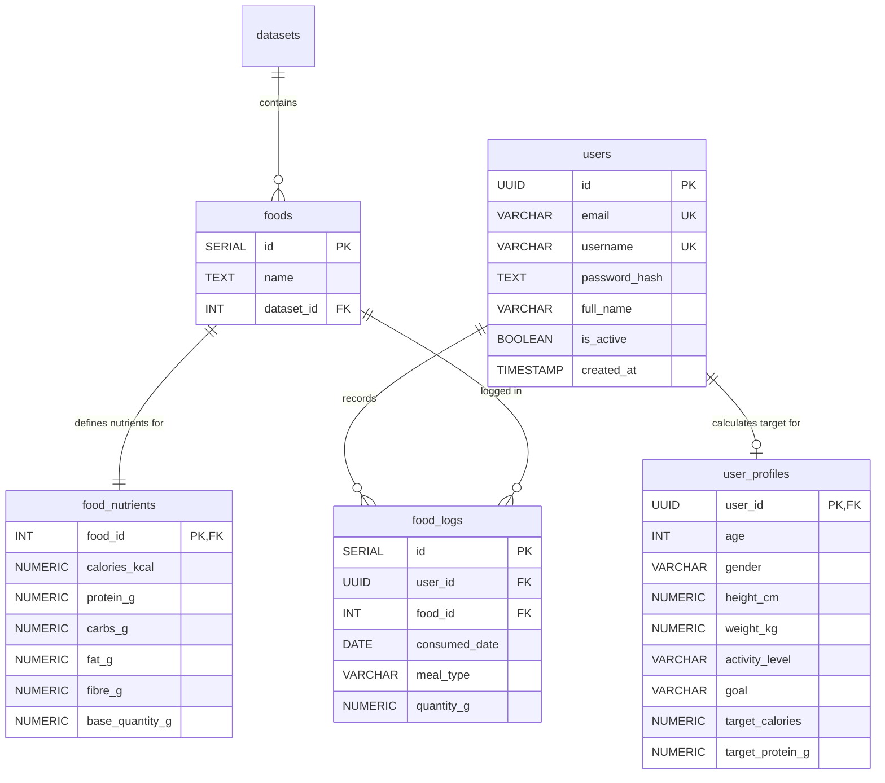

# NutriTrack 🥗 | Full-Stack Nutrition & Health Analytics Platform


**NutriTrack** is an end-to-end full-stack health, fitness, and nutrition tracking platform specifically tailored for **Indian dietary items, prepared dishes, and nutritional datasets**. 

NutriTrack empowers users to calculate individualized caloric and macronutrient targets based on biometric profiles (using the Mifflin-St Jeor BMR equation), log daily meals across breakfast, lunch, dinner, and snacks with automatic proportional scaling, analyze weekly nutrition trends, and consult an integrated AI nutrition chatbot assistant.

---

## ✨ Key Features

- 🥗 **Indian Food Dataset & Search**: Instant full-text search across hundreds of Indian dishes with detailed macronutrient and micronutrient profiles per 100g base quantity.
- 📊 **Proportional Meal Logging & Daily Summaries**: Log foods by gram quantity across meal types (`Breakfast`, `Lunch`, `Dinner`, `Snack`) with automatic dynamic proportional scaling of 11+ macro & micro-nutrients.
- 🎯 **Biometric Target Calculation**: Automated BMR & TDEE calculation powered by the **Mifflin-St Jeor equation**, adjusted for activity level (`sedentary`, `light`, `moderate`, `active`, `very_active`) and health goals (`lose`, `maintain`, `gain`).
- 🤖 **AI Nutritional Chatbot**: Natural language query interface to uncover high-protein, low-carb, low-fat, low-calorie, iron-rich, or calcium-rich meal suggestions directly backed by the PostgreSQL database.
- 📈 **7-Day Rolling Trend Analytics**: Interactive visualization of weekly caloric and protein intake trends compared against personal targets.
- 🔐 **JWT Authentication & Security**: Stateless JWT-based authentication with bcrypt salted password hashing and protected API routes.

---

## 🏗️ Architecture & Technology Stack

NutriTrack is engineered as a decoupled modern web application with a standalone Express REST API backend and a responsive Vite + React frontend.

```
                      ┌──────────────────────────────────────┐
                      │    React + Vite Single Page App      │
                      │       (TailwindCSS, Recharts)        │
                      └──────────────────┬───────────────────┘
                                         │ REST API / JWT
                                         ▼
                      ┌──────────────────────────────────────┐
                      │     Node.js + Express 5 Backend      │
                      │     (Domain-Driven Layered Monolith) │
                      └──────────────────┬───────────────────┘
                                         │ SQL Queries (pg Pool)
                                         ▼
                      ┌──────────────────────────────────────┐
                      │         PostgreSQL Database          │
                      │      (UUIDs, Triggers, Indexes)      │
                      └──────────────────────────────────────┘
```

### Stack Components

| Layer | Technology / Libraries |
| :--- | :--- |
| **Frontend** | React 18, Vite, TailwindCSS, Lucide React Icons, React Router |
| **Backend** | Node.js (ES Modules), Express.js v5, PostgreSQL `pg` client, JWT (`jsonwebtoken`), `bcrypt` |
| **Database** | PostgreSQL v14+ (`pgcrypto` extension, GIN text-search index, relational integrity triggers) |
| **Dataset** | Indian Prepared Foods Nutrition Dataset (Derived from IFCT / Kaggle) |

---

## 📂 Project Repository Structure

```
NutriTrack/
├── Backend/                            # Node.js + Express REST API Server
│   ├── package.json                    # Backend dependencies and scripts
│   ├── server.js                       # Primary HTTP server entrypoint
│   ├── README.md                       # Comprehensive Backend architecture & API documentation
│   └── src/
│       ├── app.js                      # Express app configuration instance
│       ├── config/
│       │   └── db.js                   # PostgreSQL database pool configuration
│       ├── middlewares/
│       │   ├── auth.middleware.js      # JWT Authentication middleware
│       │   └── error.middleware.js     # Global error handling middleware
│       └── modules/                    # Domain-driven feature modules
│           ├── auth/                   # Registration & Login services
│           ├── chatbot/                # AI Query processing service
│           ├── food/                   # Food dataset search service
│           ├── food_logs/              # Meal logging & daily/weekly summary aggregation
│           ├── profile/                # Biometrics & BMR/TDEE calculation engine
│           └── user/                   # User profile management
│
├── Frontend/                           # React + Vite Frontend Web App
│   ├── package.json                    # Frontend dependencies
│   ├── vite.config.js                  # Vite builder configuration
│   ├── tailwind.config.js              # Tailwind CSS configuration
│   └── src/
│       ├── App.jsx                     # Core router and layout container
│       ├── pages/                      # Application views (Dashboard, Login, Register, Profile, Chat, Search)
│       ├── components/                 # Reusable UI components
│       └── services/                   # API HTTP client & Auth storage handlers
│
├── Query/                              # PostgreSQL Database Setup Scripts
│   ├── Initial Creation.sql            # Table definitions & dataset import scripts
│   ├── Users.sql                       # User schema, pgcrypto UUID, & timestamp triggers
│   └── 02_Features_Schema.sql          # User profiles, food logs schema & performance indexes
│
├── Indian_Food_Nutrition_Processed.xlsx# Raw & processed nutrition dataset reference
├── PROJECT_STRUCTURE.md               # Folder mapping & developer guide
└── README.md                           # Main project documentation (this file)
```

---

## 🗄️ Database ER Diagram



---

## ⚡ Quick Start Guide

### 1. Database Setup
Ensure PostgreSQL is installed and running. Create a database named `nutritrack`:

```bash
psql -U postgres -c "CREATE DATABASE nutritrack;"
```

Execute the SQL scripts inside the `/Query` folder in order:
```bash
psql -U postgres -d nutritrack -f Query/"Initial Creation.sql"
psql -U postgres -d nutritrack -f Query/"Users.sql"
psql -U postgres -d nutritrack -f Query/"02_Features_Schema.sql"
```

---

### 2. Backend Setup
Navigate to the `Backend` folder, configure environment variables, and start the server:

```bash
cd Backend
npm install
```

Create a `.env` file inside `Backend/`:
```env
PORT=5000
DB_HOST=localhost
DB_PORT=5432
DB_NAME=nutritrack
DB_USER=postgres
DB_PASSWORD=your_password
JWT_SECRET=your_jwt_secret_key
JWT_EXPIRES_IN=7d
```

Start the backend development server:
```bash
npm run dev
```
The API server will run at `http://localhost:5000`.

---

### 3. Frontend Setup
In a new terminal window, navigate to the `Frontend` folder and start the React application:

```bash
cd Frontend
npm install
npm run dev
```
The frontend application will run at `http://localhost:5173`.

---

## 🔗 Documentation Links

- 📖 [Backend In-Depth Documentation & API Reference](file:///c:/Users/study/OneDrive/Desktop/Projects/NutriTrack/Backend/README.md)
- 📁 [Detailed Project Directory Structure Specification](file:///c:/Users/study/OneDrive/Desktop/Projects/NutriTrack/PROJECT_STRUCTURE.md)

---

## 📄 License
This project is open-source and released under the [ISC License](LICENSE).
